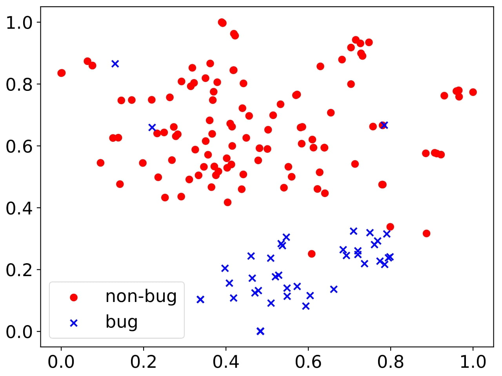
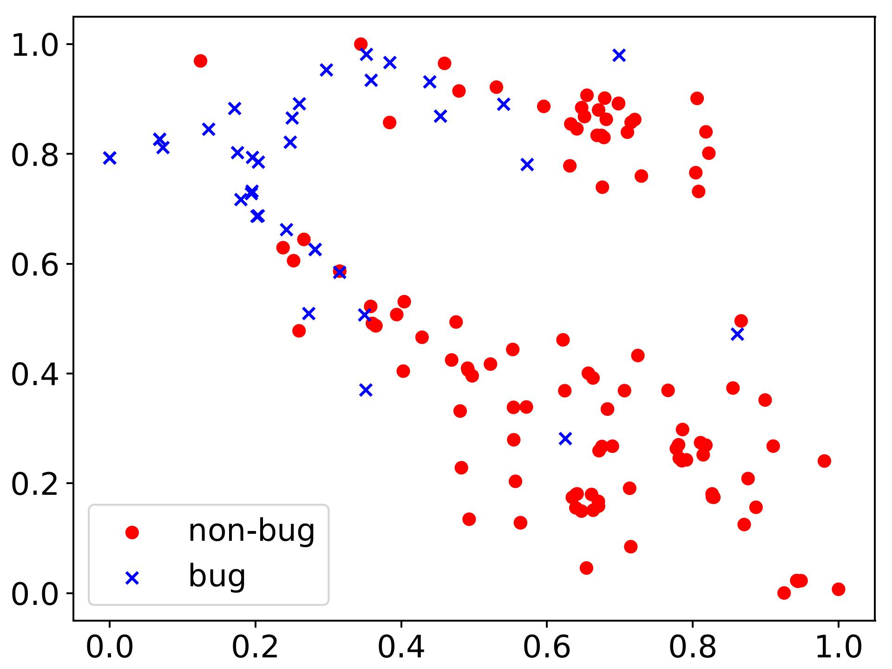
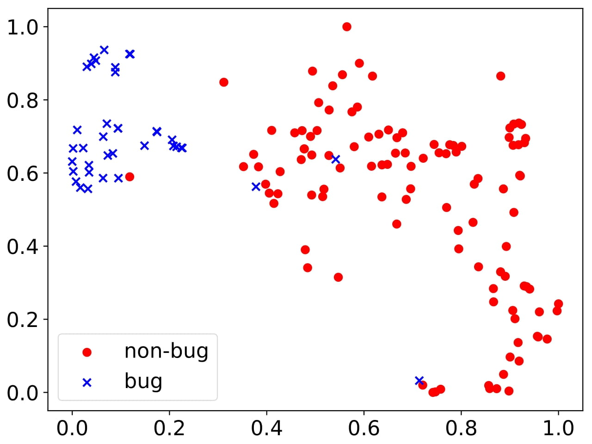
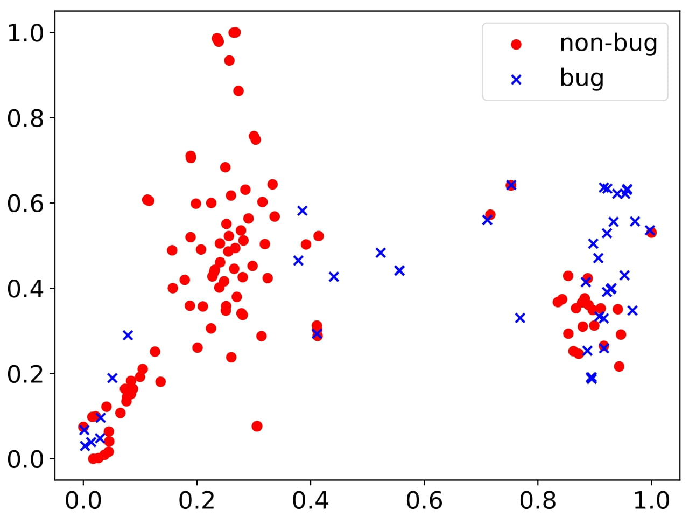
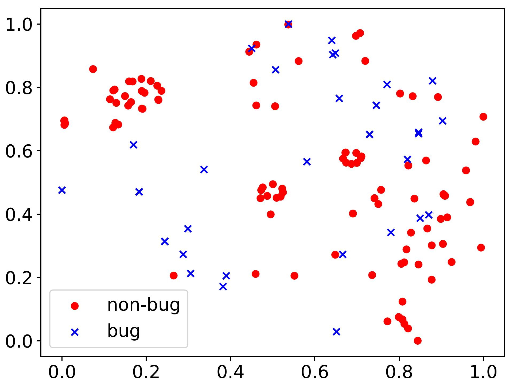
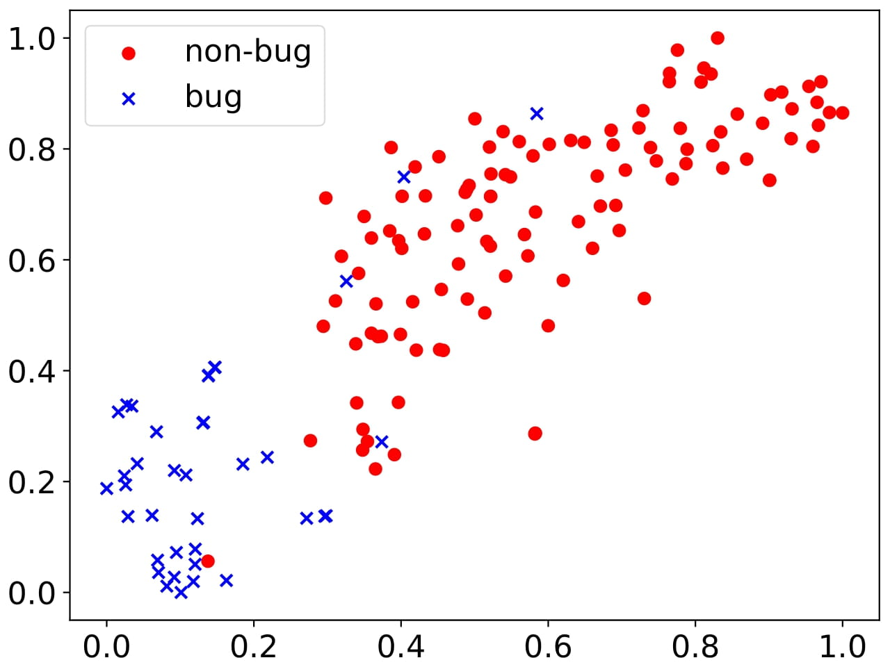

# VDNLL (Vulnerability Detection with Noisy Label Learning)
This repo is a paper on Python implementation: **A Robust Vulnerability Detection Framework by Learning From Noisy Labels**. In this paper, we propose a robust smart contract Vulnerability Detection framework with Noisy Label Learning (VDNLL). It develops a noisy label learning method based on co-training to identify mislabeled samples more accurately, facilitating the learning of robust feature representations. 

# Datasets
We adopt two recently-released and large-scale datasets [Qian et al., 2023](https://dl.acm.org/doi/10.1145/3543507.3583367) and [Li et al., 2022](https://ieeexplore.ieee.org/abstract/document/10261219) as our benchmark, which mainly covers four categories of vulnerabilities: reentrancy (RE) [Li et al., 2022](https://ieeexplore.ieee.org/abstract/document/10261219), timestamp dependence (TD) [Qian et al., 2023](https://dl.acm.org/doi/10.1145/3543507.3583367), integer overflow/underflow (OF) [Qian et al., 2023](https://dl.acm.org/doi/10.1145/3543507.3583367), suicide contract (SU) [Li et al., 2022](https://ieeexplore.ieee.org/abstract/document/10261219). The Solidity codes in the datasets are collected from the Ethereum platform, and these datasets are extensively studied in current vulnerability detection efforts, such as [GraBit](https://ieeexplore.ieee.org/document/10301241) and [ConvMHSA](https://ieeexplore.ieee.org/document/10301256).

Further instructions on the datasets can be found on [Qian-TD-OF-Datasets](https://github.com/Messi-Q/Smart-Contract-Dataset) and [Li-RE-SU-Datasets](https://github.com/Messi-Q/Smart-Contract-Dataset), which is constantly being updated to provide more details.

# Required Packages
> - Python 3.8
> - torch 1.7.1
> - faiss 1.7.1
> - numpy 1.24.3
> - scikit-learn 1.3.2

# Tools
VDNLL is more robust against noisy labels, and can effectively maintain the performance of vulnerability detection in all noisy label settings. To support this, the t-distributed stochastic neighbor embedding (TNSE) [Maaten et al., 2008](https://jmlr.org/papers/v9/vandermaaten08a.html) is applied to visualize the feature representations of the RE dataset. 

<table>
    <tr>
        <td >
 GraBit (clean) 
</td>
        <td >
 ConvMHSA (clean) 
</td>
        <td >
 VDNLL(clean) 
</td>
    </tr>
    <tr>
        <td >
 GraBit (noise) 
</td>
        <td >
 ConvMHSA (noise) 
</td>
        <td >
 VDNLL(noise) 
</td>
    </tr>
</table>

In the above figure, we present the feature representations learned by the GraBit, ConvMHSA, and VDNLL, in the clean and noisy label settings. Compared to existing popular vulnerability detection methods, the feature representations learned by the VDNLL are always more class-discriminative. This proves that our approach can indeed learn robust code feature representations from noisy labels.

We will continue to add and update more details on this work.
